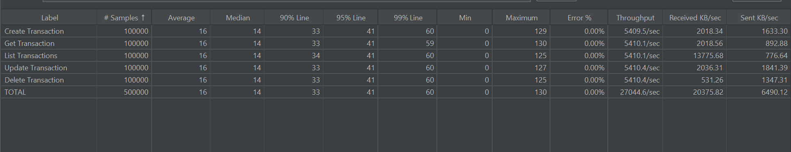

# Transaction Service

A high-performance, concurrent transaction management system built with Spring Boot and Java.

## Features

- Concurrent transaction processing using virtual threads
- In-memory transaction storage with caching
- RESTful API endpoints
- Input validation
- Duplicate transaction detection
- Pagination support
- Comprehensive test coverage

## Tech Stack

- Java 21
- Spring Boot 3.x
- Spring Cache
- Jakarta Validation
- JUnit 5
- JMeter (for load testing)

## Getting Started

### Prerequisites

- Java 21 or later
- Maven
- Docker (optional)

### Building the Project

```bash
# Build the project
./mvnw clean package

# Run tests
./mvnw test

# Run performance tests
./mvnw test -Dtest=TransactionPerformanceTest
```

### Running the Application

```bash
# Run with Maven
./mvnw spring-boot:run

# Run the JAR file
java -jar target/transaction-0.0.1-SNAPSHOT.jar
```

### Docker Support

```bash
# Build Docker image
docker build -t transaction-service:latest .

# Run Docker container
docker run -p 8080:8080 transaction-service:latest
```

## API Endpoints

- `POST /api/transactions` - Create a new transaction
- `GET /api/transactions/{id}` - Get a transaction by ID
- `PUT /api/transactions/{id}` - Update a transaction
- `DELETE /api/transactions/{id}` - Delete a transaction
- `GET /api/transactions` - List transactions (with pagination)

## Performance Testing

The project includes:
- JMeter load test configuration
- Performance test suite
- Benchmark tests using JMH

To run load tests:
1. Start the application
2. Open JMeter
3. Load `src/test/resources/TransactionLoadTest.jmx`
4. Run the test plan

## Architecture

- In-memory storage using `ConcurrentHashMap`
- Caching with Spring Cache
- Async processing with `CompletableFuture`
- Thread-safe operations
- Input validation using Jakarta Validation

## Testing

The project includes:
- Unit tests
- Edge case tests
- Validation tests
- Concurrency tests
- Performance tests
- Load tests

## Test Results(Jmeter)


